<h1 align="center">¡Hola! Soy Fernando 👋</h1>

  
  
  

## 🚀 Sobre mí

- Desarrollo soluciones prácticas orientadas a resultados.
- Me adapto a distintos contextos técnicos: automatización, análisis, aplicaciones y producto.
- me interesa aprender, construir y colaborar en horizontes amplios.
- Trabajo tanto en proyectos visibles como en trabajo técnico de repositorios privados.

## 🧰 Stack Tecnológico

  
  
  
  
  
  
  
  
  
  
  

## 📊 GitHub Readme Stats

  

## 🧭 Enfoque de trabajo

- Exploración continua de nuevas tecnologías y enfoques.
- Capacidad de moverme entre investigación, desarrollo y mejora de productos.
- Construcción de soluciones útiles, mantenibles y con visión de crecimiento.

## 🤝 Contacto

- GitHub: [@SksFer](https://github.com/SksFer)
- Gmail: qfernando979@gmail.com
